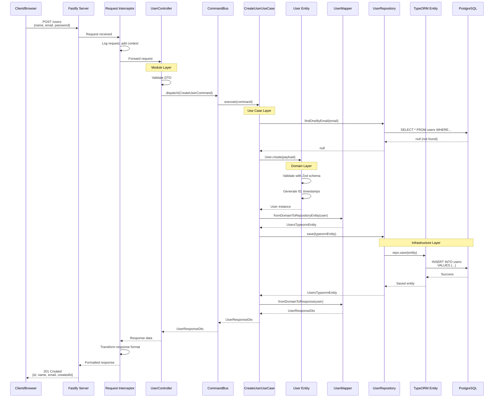
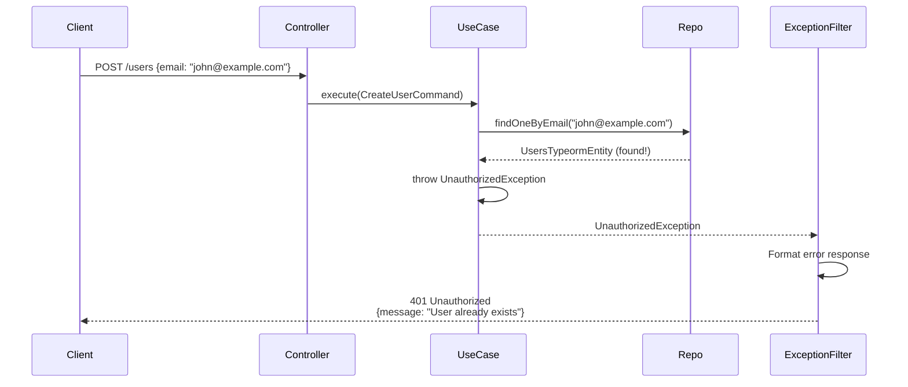
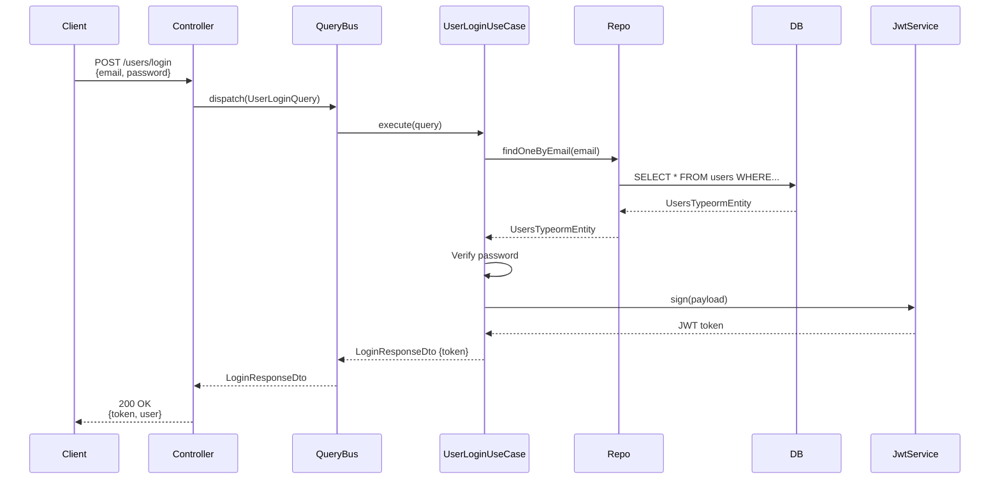

# Data Flow Through the Application

This document visualizes how a request flows through the application layers, from HTTP request to database and back.

## Complete Request Flow

Let's trace a "Create User" request through the entire system:



---

## Step-by-Step Breakdown

### 1. HTTP Request Arrives

**File**: `src/main.ts`

```typescript
// Fastify receives the request
POST http://localhost:3000/users
Content-Type: application/json

{
  "name": "John Doe",
  "email": "john@example.com",
  "password": "securePassword123"
}
```

### 2. Global Interceptor

**File**: `src/library/core/interceptors/request.interceptor.ts`

```typescript
@Injectable()
export class RequestInterceptor implements NestInterceptor {
  intercept(context: ExecutionContext, next: CallHandler) {
    // Log incoming request
    // Add correlation ID
    // Start performance timer
    return next.handle();
  }
}
```

**What happens**: Request logging, context setup, performance tracking begins.

### 3. Controller Receives Request

**File**: `src/modules/users/user.controller.ts`

```typescript
@Controller('users')
export class UserController {
  constructor(private readonly commandBus: CommandBus) {}

  @Post()
  async createUser(@Body() dto: CreateUserDto) {
    // NestJS validates the DTO automatically
    // Then dispatches the command
    return this.commandBus.execute(new CreateUserCommand(dto));
  }
}
```

**What happens**:

- Route matched: `POST /users`
- DTO validation (Zod or class-validator)
- Command created and dispatched

### 4. Command Bus Routes to Use Case

**File**: `src/modules/users/services/command/create-user.command.ts`

```typescript
export class CreateUserCommand {
  constructor(public readonly dto: CreateUserDto) {}
}
```

**File**: `src/modules/users/services/usecase/create-user.use-case.ts`

```typescript
@CommandHandler(CreateUserCommand)
export class CreateUserUseCase implements ICommandHandler<CreateUserCommand> {
  constructor(
    private readonly userRepository: UserRepository,
    private readonly userMapper: UserMapper,
    private readonly crypt: CryptService,
  ) {}

  async execute(command: CreateUserCommand): Promise<UserResponseDto> {
    // Orchestrates the business logic
  }
}
```

**What happens**: CQRS infrastructure routes the command to the appropriate handler.

### 5. Business Rule Validation

```typescript
// Check if user already exists
const existingUser = await this.userRepository.findOneByEmail(command.dto.email);
if (existingUser) {
  throw new UnauthorizedException('User already exists');
}
```

**What happens**:

- Query repository
- Database lookup
- Business rule enforcement (no duplicate emails)

### 6. Domain Entity Creation

**File**: `src/modules/users/domain/user.entity.ts`

```typescript
const user = User.create({
  id: entityId(), // Generate unique ID
  fields: {
    name: command.dto.name,
    email: UserEmailValueObject.create(command.dto.email),
    password: await this.crypt.toHash(command.dto.password),
    deletedAt: null,
  },
});
```

**What happens**:

- Unique ID generated
- Value objects created (email)
- Password hashed
- Domain entity constructed
- **Zod validation** runs automatically in the constructor
- If validation fails, error is thrown immediately

### 7. Validation in Domain Entity

```typescript
protected getEntityFieldsSchema(): EntityFieldSchema<UserEntityFields> {
  return z.object({
    name: z.string(),
    email: z.instanceof(UserEmailValueObject),
    password: z.string(),
    deletedAt: z.date().nullable(),
  }).strict();
}
```

**What happens**: Schema validation ensures data integrity at the domain level.

### 8. Transformation to Database Entity

**File**: `src/modules/users/mapper/user.mapper.ts`

```typescript
fromDomainToRepositoryEntity(user: User): UsersTypeormEntity {
  const entity = new UsersTypeormEntity();
  entity.id = user.id;
  entity.name = user.toObject().name;
  entity.email = this.userEmailMapper.fromValueObjectToEmbed(user.toObject().email);
  entity.password = user.toObject().password;
  entity.createdAt = user.createdAt;
  entity.updatedAt = user.updatedAt;
  entity.deletedAt = user.toObject().deletedAt;
  return entity;
}
```

**What happens**: Domain entity converted to TypeORM entity (database representation).

### 9. Persistence

**File**: `src/modules/users/repository/user.typeorm-adapter.ts`

```typescript
// Use case calls:
await this.userRepository.save(typeormEntity);

// Which calls TypeORM:
return this.repo.save(entity);
```

**SQL Generated**:

```sql
INSERT INTO users (id, name, email, password, created_at, updated_at, deleted_at)
VALUES ($1, $2, $3, $4, $5, $6, $7)
RETURNING *;
```

**What happens**: Data persisted to PostgreSQL database.

### 10. Response Transformation

**File**: `src/modules/users/mapper/user.mapper.ts`

```typescript
fromDomainToResponse(user: User): UserResponseDto {
  return {
    id: user.id,
    name: user.toObject().name,
    email: user.toObject().email.email,
    createdAt: user.createdAt,
  };
}
```

**What happens**: Domain entity transformed to response DTO (hides sensitive fields like password).

### 11. Response Interceptor

**File**: `src/library/core/interceptors/response.interceptor.ts`

```typescript
@Injectable()
export class ResponseInterceptor implements NestInterceptor {
  intercept(context: ExecutionContext, next: CallHandler) {
    return next.handle().pipe(map((data) => ({ success: true, data, timestamp: new Date().toISOString() })));
  }
}
```

**What happens**: Response wrapped in standard format.

### 12. HTTP Response Sent

```json
HTTP/1.1 201 Created
Content-Type: application/json

{
  "success": true,
  "data": {
    "id": "usr_abc123xyz",
    "name": "John Doe",
    "email": "john@example.com",
    "createdAt": "2026-01-06T13:23:45.123Z"
  },
  "timestamp": "2026-01-06T13:23:45.123Z"
}
```

---

## Error Flow Example

What happens if the email already exists?



**Response**:

```json
{ "success": false, "statusCode": 401, "message": "User already exists", "timestamp": "2026-01-06T13:23:45.123Z" }
```

---

## Read Operation Flow (Query)

Example: `POST /users/login`



**Key difference**: Queries don't modify state, only read and return data.

---

## Layer Responsibility Summary

| Step  | Layer               | Responsibility                       |
| ----- | ------------------- | ------------------------------------ |
| 1-2   | Application         | Receive request, global interceptors |
| 3     | Module (Controller) | Route to appropriate command/query   |
| 4     | Module (CQRS)       | Dispatch to use case handler         |
| 5-6   | Domain              | Business validation, entity creation |
| 7     | Domain              | Schema validation (Zod)              |
| 8     | Module (Mapper)     | Transform domain ↔ infrastructure    |
| 9     | Infrastructure      | Persist to database                  |
| 10    | Module (Mapper)     | Transform to response DTO            |
| 11-12 | Application         | Format and send response             |

---

## Common Patterns

### Pattern 1: Command (Write)

1. Controller receives DTO
2. Dispatch Command
3. Use Case enforces business rules
4. Create/modify domain entity
5. Persist via repository
6. Return success DTO

### Pattern 2: Query (Read)

1. Controller receives query params
2. Dispatch Query
3. Use Case calls repository
4. Repository queries database
5. Map to response DTO
6. Return data

### Pattern 3: Error Handling

1. Error thrown at any layer
2. Bubbles up to exception filter
3. Filter transforms to standard error response
4. HTTP error code sent to client

---

## Performance Considerations

### Database Queries

```typescript
// ❌ N+1 query problem
for (const user of users) {
  user.tasks = await taskRepo.find({ userId: user.id });
}

// ✅ Use eager loading or joins
const users = await userRepo.find({ relations: ['tasks'] });
```

### Caching

```typescript
@Injectable()
export class UserLoginUseCase {
  constructor(private readonly cacheManager: Cache) {}

  async execute(query: UserLoginQuery) {
    // Check cache first
    const cached = await this.cacheManager.get(`user:${email}`);
    if (cached) return cached;

    // If not cached, fetch and cache
    const user = await this.userRepository.findOneByEmail(email);
    await this.cacheManager.set(`user:${email}`, user, 3600);
    return user;
  }
}
```

---

## Debugging Tips

### 1. Add Logging at Each Layer

```typescript
// In use case
this.logger.debug('CreateUserUseCase: Start', { email: command.dto.email });
```

### 2. Use Request ID

Request interceptor adds a correlation ID that flows through all logs.

### 3. Database Query Logging

Enable in `typeorm.config.ts`:

```typescript
{
  logging: process.env.NODE_ENV === 'development' ? 'all' : ['error'],
}
```

---

## Next Steps

- **Build a feature**: [Creating a Module Tutorial](../tutorials/creating-a-module.md)
- **Understand CQRS**: [CQRS Pattern Guide](../guides/cqrs-pattern.md)
- **Learn layers**: [Layer Breakdown](layers.md)
