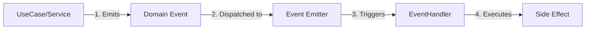

# Event-Driven Architecture

This project uses an **Event-Driven Architecture (EDA)** to handle side effects and decouple components. This allows our core business logic to remain focused while delegating auxiliary tasks (like sending emails, logging, or notifications) to event handlers.

## Core Concepts

### 1. Domain Events vs. Integration Events

We distinguish between two types of events, though currently we primarily use **Domain Events** (internal application events).

- **Domain Events**: Significant things that happened within the domain (e.g., `UserRegistered`, `OrderPlaced`). These are handled within the same process.
- **Integration Events**: Events shared between different microservices or contexts (e.g., via RabbitMQ/Kafka). (Future scope).

### 2. The Pattern



## Implementation

We use `@nestjs/event-emitter` (which wraps `eventemitter2`) for in-process event handling.

### emitting Events

Events are simple classes that carry data about what happened.

**Example: `UserRegisteredEvent`**

```typescript
// src/modules/users/domain/events/user-registered.event.ts
export class UserRegisteredEvent {
  constructor(
    public readonly userId: string,
    public readonly email: string,
  ) {}
}
```

**Dispatching the Event**

In your Command Handler or Service, inject `EventEmitter2` and emit the event after the main action succeeds.

```typescript
// src/modules/users/services/command/create-user.use-case.ts
constructor(private readonly eventEmitter: EventEmitter2) {}

async execute(command: CreateUserCommand) {
  // ... create user logic ...
  const user = await this.repo.save(newUser);

  // Emit event
  this.eventEmitter.emit(
    'user.registered',
    new UserRegisteredEvent(user.id, user.email)
  );
}
```

### Handling Events

Event handlers are specialized services that listen for specific events.

```typescript
// src/external/mailer/event-handler/user-register-mailer.event-handler.ts
@Injectable()
export class UserRegisterMailerEventHandler {
  @OnEvent('user.registered', { async: true }) // async: true for non-blocking
  async handle(event: UserRegisteredEvent) {
    // Perform side effect (e.g., send email)
    await this.mailerService.sendWelcomeEmail(event.email);
  }
}
```

## Best Practices

1.  **Fire-and-Forget**: Most side effects (emails, logs) should be async and not block the main response. Use `{ async: true }` in the listener.
2.  **Idempotency**: Event handlers should ideally be idempotent, meaning handling the same event twice shouldn't break anything.
3.  **Transactions**: Be careful when mixing events with database transactions. Usually, you want to emit the event _after_ the transaction commits.
4.  **Error Handling**: Errors in async event handlers won't block the main request but should be logged properly.

## Common Use Cases

- **Notifications**: Sending emails, SMS, or push notifications.
- **Analytics**: Tracking user actions.
- **Audit Logging**: Recording critical changes.
- **Search Indexing**: Updating ElasticSearch/Algolia when data changes.
