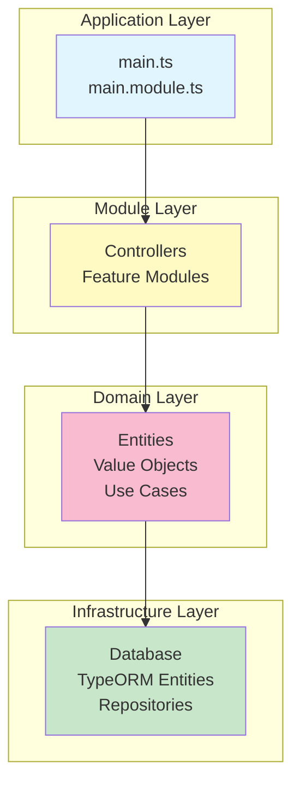
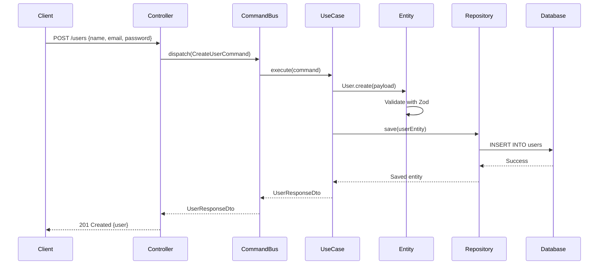

# Architecture Overview

This document explains the architectural principles and design patterns used in this NestJS skeleton project.

## Why This Architecture?

This project uses **Clean Architecture** combined with **Domain-Driven Design (DDD)** principles to create a maintainable, testable, and scalable backend application.

### The Problem We're Solving

As applications grow, they become harder to maintain if the code isn't well-organized:

- Business logic gets mixed with database code
- Changes in one area break unrelated features
- Testing becomes difficult
- New developers struggle to understand the code

### Our Solution

We use a **layered architecture** where each layer has a specific responsibility and clear boundaries.

## Architecture Layers



### Dependency Rule

**Critical principle**: Dependencies flow inward only.

- Outer layers can depend on inner layers
- Inner layers **never** depend on outer layers
- The domain layer is at the center and knows nothing about databases or frameworks

This means:

- ✅ Use Cases can use Entities
- ✅ Controllers can use Use Cases
- ❌ Entities cannot use TypeORM
- ❌ Domain cannot import NestJS decorators

## Clean Architecture Benefits

### 1. **Separation of Concerns**

Each layer has a single responsibility:

- **Application Layer**: Bootstrap and global configuration
- **Module Layer**: Feature-specific routes and orchestration
- **Domain Layer**: Business rules and validation
- **Infrastructure Layer**: Database and external services

### 2. **Testability**

Because layers are separated, you can test each independently:

```typescript
// Test domain logic without a database
const user = User.create({ id: '1', fields: { name: 'John', ... } });
expect(user.id).toBe('1');

// Test use cases with mocked repositories
const mockRepo = { save: jest.fn() };
const useCase = new CreateUserUseCase(mockRepo);
```

### 3. **Flexibility**

Want to switch from TypeORM to Prisma? Only the infrastructure layer changes. Your domain logic and use cases remain untouched.

### 4. **Scalability**

As the project grows, the structure remains clear:

- Add new features as new modules
- Share common logic in the library layer
- Domain stays pure and reusable

## Domain-Driven Design (DDD)

### What is DDD?

DDD is an approach to software development that focuses on:

1. Understanding the business domain deeply
2. Creating a model that reflects the domain
3. Using a common language (ubiquitous language) between developers and domain experts

### DDD in This Project

#### Entities

**What**: Objects with unique identity that persist over time.

**Example**: A `User` entity has an ID that uniquely identifies them, even if their name or email changes.

```typescript
// Domain entity (pure business logic)
export class User extends Entity<UserEntityFields, UserEntityCreationPayload> {
  // Business logic and validation
  protected getEntityFieldsSchema() {
    return z.object({
      name: z.string(),
      email: z.instanceof(UserEmailValueObject),
      password: z.string(),
      deletedAt: z.date().nullable(),
    });
  }
}
```

#### Value Objects

**What**: Objects without unique identity, defined only by their attributes.

**Example**: An email address is a value object. Two emails with the same address are identical.

```typescript
// Value object for email
export class UserEmailValueObject extends ValueObject<UserEmailFields> {
  // Encapsulates email validation and behavior
  protected getValueObjectFieldsSchema() {
    return z.object({ email: z.string().email(), safeEmail: z.string() });
  }
}
```

#### Aggregates

**What**: A cluster of entities and value objects treated as a single unit.

**Example**: A `User` aggregate might include the user entity and related value objects (email, password hash).

#### Repositories

**What**: Abstractions for accessing and persisting aggregates.

**Why**: Keeps database details out of domain logic.

```typescript
// Abstract repository (domain layer)
export abstract class UserRepository extends Repository<UsersTypeormEntity> {
  abstract findOneByEmail(email: string): Promise<UsersTypeormEntity | null>;
}

// Implementation (infrastructure layer)
@Injectable()
export class UserTypeormAdapter extends UserRepository {
  // TypeORM-specific implementation
}
```

## CQRS Pattern

**CQRS** = Command Query Responsibility Segregation

We separate operations into two categories:

### Commands (Write Operations)

- Create, update, delete
- Change system state
- May have side effects

```typescript
@CommandHandler(CreateUserCommand)
export class CreateUserUseCase implements ICommandHandler<CreateUserCommand> {
  async execute(command: CreateUserCommand) {
    // Business logic to create user
  }
}
```

### Queries (Read Operations)

- Fetch, search, list
- Don't change state
- Optimized for reading

```typescript
@QueryHandler(UserLoginQuery)
export class UserLoginUseCase implements IQueryHandler<UserLoginQuery> {
  async execute(query: UserLoginQuery) {
    // Logic to authenticate and return user data
  }
}
```

**Why CQRS?**

- Different optimization strategies for reads vs writes
- Clearer code organization
- Easier to scale (can separate read/write databases later)
- Better security (different permissions for commands vs queries)

## Request Flow Example

Let's trace a "Create User" request through the architecture:



**Step by step**:

1. Client sends HTTP request
2. Controller receives request, creates Command
3. Command is dispatched to the appropriate Use Case handler
4. Use Case creates a Domain Entity (validation happens here)
5. Use Case calls Repository to persist
6. Repository converts domain entity to TypeORM entity and saves
7. Database confirms save
8. Response flows back through the layers

## When to Use This Architecture

### ✅ Good For:

- **Medium to large applications** with complex business logic
- **Team projects** where multiple developers work on different features
- **Long-lived projects** that will be maintained for years
- **Projects requiring high testability** and maintainability

### ⚠️ Maybe Overkill For:

- **Simple CRUD apps** with minimal business logic
- **Prototypes or MVPs** that need to be built quickly
- **Solo projects** with very limited scope
- **Microservices** that only do one simple thing

## When NOT to Use This Architecture

If your application is primarily:

- Simple data transformations with no business rules
- A thin wrapper around a database
- A quick internal tool with no complex logic

Consider a simpler structure. Don't over-engineer!

## Trade-offs

### Pros

✅ Highly maintainable and testable  
✅ Clear separation of concerns  
✅ Easy to onboard new developers (once they understand the pattern)  
✅ Flexible to changing requirements  
✅ Scalable architecture

### Cons

❌ More files and boilerplate  
❌ Steeper learning curve for beginners  
❌ Initial development is slower  
❌ Can be overkill for simple use cases

## Key Principles to Remember

1. **Keep the domain pure** - No framework dependencies in domain entities
2. **Use abstractions** - Depend on interfaces, not implementations
3. **One way dependencies** - Inner layers never depend on outer layers
4. **Single Responsibility** - Each file/class does one thing well
5. **Explicit is better than implicit** - Clear naming and structure

## Next Steps

Now that you understand the architecture:

1. **See it in action**: [Data Flow Guide](data-flow.md) - Follow a request through the system
2. **Understand each layer**: [Layer Breakdown](layers.md) - Deep dive into responsibilities
3. **Build something**: [Creating a Module Tutorial](../tutorials/creating-a-module.md) - Apply these concepts

## Further Reading

- [Clean Architecture](https://blog.cleancoder.com/uncle-bob/2012/08/13/the-clean-architecture.html) by Uncle Bob
- [Domain-Driven Design](https://www.domainlanguage.com/ddd/) by Eric Evans
- [CQRS Pattern](https://martinfowler.com/bliki/CQRS.html) by Martin Fowler
- [Hexagonal Architecture](https://alistair.cockburn.us/hexagonal-architecture/) by Alistair Cockburn
