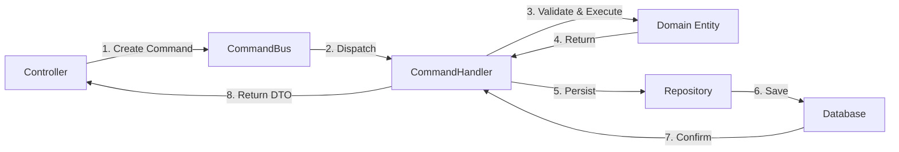
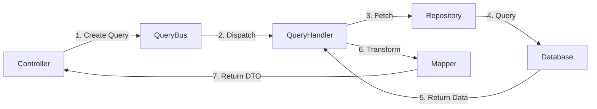

# CQRS Pattern Guide

CQRS (Command Query Responsibility Segregation) is a pattern that separates read and write operations into different models. This guide explains how and why we use CQRS in this project.

## What is CQRS?

**CQRS** = **Command** **Query** **Responsibility** **Segregation**

It's a design pattern that separates operations into two categories:

- **Commands**: Operations that **change state** (write)
- **Queries**: Operations that **return data** without changing state (read)

### The Problem CQRS Solves

In traditional CRUD applications, the same model is used for both reading and writing data:

```typescript
// ❌ Traditional approach - one model for everything
class UserService {
  createUser(data) {
    /* write */
  }
  updateUser(data) {
    /* write */
  }
  deleteUser(id) {
    /* write */
  }
  getUser(id) {
    /* read */
  }
  listUsers(filters) {
    /* read */
  }
  searchUsers(query) {
    /* read */
  }
}
```

**Problems**:

- Read and write operations have different requirements
- Difficult to optimize (reads need caching, writes need validation)
- Hard to scale (reads and writes scale differently)
- Security concerns (same permissions for reads and writes)
- Complexity grows as features are added to the same service

### The CQRS Solution

```typescript
// ✅ CQRS approach - separate models

// Commands (writes)
class CreateUserCommand {}
class UpdateUserCommand {}
class DeleteUserCommand {}

// Queries (reads)
class GetUserQuery {}
class ListUsersQuery {}
class SearchUsersQuery {}
```

**Benefits**:

- Clear separation of concerns
- Different optimization strategies for reads vs writes
- Easier to scale independently
- Better security (different permissions)
- Simpler code (each handler does one thing)

---

## Commands: Write Operations

### What is a Command?

A command represents an **intention to change state** in the system.

**Characteristics**:

- Changes data (create, update, delete)
- Has side effects
- Should be validated before execution
- Usually returns the modified data or a success indicator

### Command Structure

```typescript
// 1. Command class (describes the intention)
export class CreateUserCommand {
  constructor(public readonly dto: CreateUserDto) {}
}

// 2. Command handler (executes the intention)
@CommandHandler(CreateUserCommand)
export class CreateUserUseCase implements ICommandHandler<CreateUserCommand> {
  constructor(
    private readonly userRepository: UserRepository,
    private readonly mapper: UserMapper,
    private readonly crypt: CryptService,
  ) {}

  async execute(command: CreateUserCommand): Promise<UserResponseDto> {
    // Business logic here
  }
}
```

### Real Example: CreateUserCommand

**File**: `src/modules/users/services/command/create-user.command.ts`

```typescript
import { CreateUserDto } from '@module/users/dto/requests/create-user.dto';

export class CreateUserCommand {
  constructor(public readonly dto: CreateUserDto) {}
}
```

**File**: `src/modules/users/services/usecase/create-user.use-case.ts`

```typescript
@CommandHandler(CreateUserCommand)
export class CreateUserUseCase implements ICommandHandler<CreateUserCommand, UserResponseDto> {
  constructor(
    private readonly userRepository: UserRepository,
    private readonly userMapper: UserMapper,
    private readonly userEmailMapper: UserEmailMapper,
    private readonly crypt: CryptService,
  ) {}

  async execute(command: CreateUserCommand): Promise<UserResponseDto> {
    // 1. Check business rules
    const lookupEmail = this.userEmailMapper.fromRequestToLookup(command.dto.email);
    const existedUser = await this.userRepository.findOneByEmail(lookupEmail);

    if (existedUser) {
      throw new UnauthorizedException('User already exists');
    }

    // 2. Create domain entity
    const userEmail = UserEmailValueObject.create(command.dto.email);
    const payload: UserEntityCreationPayload = {
      id: entityId(),
      fields: {
        name: command.dto.name,
        email: userEmail,
        password: await this.crypt.toHash(command.dto.password),
        deletedAt: null,
      },
    };

    const user = User.create(payload);

    // 3. Persist to database
    await this.userRepository.save(this.userMapper.fromDomainToRepositoryEntity(user));

    // 4. Return response
    return this.userMapper.fromDomainToResponse(user);
  }
}
```

### Using Commands in Controllers

```typescript
@Controller('users')
export class UserController {
  constructor(private readonly commandBus: CommandBus) {}

  @Post()
  async createUser(@Body() dto: CreateUserDto) {
    // Dispatch command to the bus
    return this.commandBus.execute(new CreateUserCommand(dto));
  }
}
```

### When to Use Commands

✅ **Use commands when**:

- Creating new resources (`POST /users`)
- Updating existing resources (`PUT /users/:id`, `PATCH /users/:id`)
- Deleting resources (`DELETE /users/:id`)
- Performing actions that change state (`POST /users/:id/verify-email`)

❌ **Don't use commands for**:

- Fetching data (`GET /users`, `GET /users/:id`)
- Search operations (`GET /users/search`)
- Any read-only operation

---

## Queries: Read Operations

### What is a Query?

A query represents a **request for information** without changing state.

**Characteristics**:

- Returns data
- No side effects (doesn't modify data)
- Can be cached
- Usually optimized for performance

### Query Structure

```typescript
// 1. Query class (describes what to fetch)
export class UserLoginQuery {
  constructor(public readonly dto: UserLoginDto) {}
}

// 2. Query handler (fetches the data)
@QueryHandler(UserLoginQuery)
export class UserLoginUseCase implements IQueryHandler<UserLoginQuery> {
  constructor(
    private readonly userRepository: UserRepository,
    private readonly crypt: CryptService,
    private readonly jwtService: JwtService,
  ) {}

  async execute(query: UserLoginQuery): Promise<UserLoginResponseDto> {
    // Fetch and return data
  }
}
```

### Real Example: UserLoginQuery

**File**: `src/modules/users/services/query/user-login.query.ts`

```typescript
import { UserLoginDto } from '@module/users/dto/requests/user-login.dto';

export class UserLoginQuery {
  constructor(public readonly dto: UserLoginDto) {}
}
```

**File**: `src/modules/users/services/usecase/user-login.use-case.ts`

```typescript
@QueryHandler(UserLoginQuery)
export class UserLoginUseCase implements IQueryHandler<UserLoginQuery, UserLoginResponseDto> {
  constructor(
    private readonly userRepository: UserRepository,
    private readonly userEmailMapper: UserEmailMapper,
    private readonly crypt: CryptService,
    private readonly jwtService: JwtService,
    private readonly cacheManager: Cache,
  ) {}

  async execute(query: UserLoginQuery): Promise<UserLoginResponseDto> {
    // 1. Find user by email
    const lookupEmail = this.userEmailMapper.fromRequestToLookup(query.dto.email);
    const user = await this.userRepository.findOneByEmail(lookupEmail);

    if (!user) {
      throw new UnauthorizedException('Invalid credentials');
    }

    // 2. Verify password
    const isValidPassword = await this.crypt.compare(query.dto.password, user.password);

    if (!isValidPassword) {
      throw new UnauthorizedException('Invalid credentials');
    }

    // 3. Generate JWT token
    const payload = { id: user.id };
    const token = this.jwtService.sign(payload);

    // 4. Return response
    return { token, user: { id: user.id, name: user.name, email: user.email.email } };
  }
}
```

### Using Queries in Controllers

```typescript
@Controller('users')
export class UserController {
  constructor(private readonly queryBus: QueryBus) {}

  @Post('login')
  @HttpCode(200) // Login is a POST but returns data
  async login(@Body() dto: UserLoginDto) {
    // Dispatch query to the bus
    return this.queryBus.execute(new UserLoginQuery(dto));
  }
}
```

### When to Use Queries

✅ **Use queries when**:

- Fetching a single resource (`GET /users/:id`)
- Listing resources (`GET /users`)
- Searching (`GET /users/search?q=john`)
- Any read-only operation

❌ **Don't use queries for**:

- Creating, updating, or deleting data
- Operations with side effects
- State-changing operations

---

## Commands vs Queries Comparison

| Aspect           | Commands                    | Queries              |
| ---------------- | --------------------------- | -------------------- |
| **Purpose**      | Change state                | Read state           |
| **HTTP Methods** | POST, PUT, PATCH, DELETE    | GET                  |
| **Side Effects** | Yes                         | No                   |
| **Returns**      | Modified data or success    | Requested data       |
| **Caching**      | Not cacheable               | Cacheable            |
| **Validation**   | Business rules enforced     | Minimal validation   |
| **Performance**  | Optimized for writes        | Optimized for reads  |
| **Examples**     | Create user, Update profile | Get user, List users |

---

## CQRS Flow in This Project

### Command Flow



### Query Flow



---

## Best Practices

### 1. One Command/Query Per Use Case

❌ **Bad**:

```typescript
// One handler doing multiple things
@CommandHandler(UserCommand)
export class UserUseCase {
  execute(command: UserCommand) {
    if (command.action === 'create') {
      /* ... */
    }
    if (command.action === 'update') {
      /* ... */
    }
    if (command.action === 'delete') {
      /* ... */
    }
  }
}
```

✅ **Good**:

```typescript
// Separate handlers for each operation
@CommandHandler(CreateUserCommand)
export class CreateUserUseCase {
  /* ... */
}

@CommandHandler(UpdateUserCommand)
export class UpdateUserUseCase {
  /* ... */
}

@CommandHandler(DeleteUserCommand)
export class DeleteUserUseCase {
  /* ... */
}
```

### 2. Keep Handlers Focused

Each handler should do **one thing well**:

- Validate input
- Execute business logic
- Call repository
- Return response

Don't mix concerns like sending emails, logging analytics, etc. Use **domain events** for that.

### 3. Use DTOs for Input/Output

```typescript
// Input DTO
export class CreateUserDto {
  name: string;
  email: string;
  password: string;
}

// Output DTO
export class UserResponseDto {
  id: string;
  name: string;
  email: string;
  createdAt: Date;
  // Don't expose password!
}
```

### 4. Commands Should Validate

Commands enforce business rules:

```typescript
async execute(command: CreateUserCommand) {
  // ✅ Check business constraints
  const existingUser = await this.repo.findByEmail(command.dto.email);
  if (existingUser) {
    throw new ConflictException('Email already exists');
  }

  // ✅ Validate domain rules
  const user = User.create(payload); // Throws if invalid

  // ✅ Persist
  await this.repo.save(user);
}
```

### 5. Queries Should Be Fast

Optimize queries for reading:

```typescript
async execute(query: ListUsersQuery) {
  // ✅ Add pagination
  const { page = 1, limit = 10 } = query.dto;

  // ✅ Use caching
  const cacheKey = `users:page:${page}`;
  const cached = await this.cache.get(cacheKey);
  if (cached) return cached;

  // ✅ Select only needed fields
  const users = await this.repo.find({
    select: ['id', 'name', 'email'],
    take: limit,
    skip: (page - 1) * limit,
  });

  await this.cache.set(cacheKey, users, 300); // Cache for 5 min
  return users;
}
```

---

## Advanced: Why Use CQRS Bus?

### Without CQRS Bus (Direct Call)

```typescript
@Controller('users')
export class UserController {
  constructor(
    private readonly createUserUseCase: CreateUserUseCase,
    private readonly updateUserUseCase: UpdateUserUseCase,
    private readonly deleteUserUseCase: DeleteUserUseCase,
  ) {}
  // Need to inject every use case manually
}
```

### With CQRS Bus

```typescript
@Controller('users')
export class UserController {
  constructor(
    private readonly commandBus: CommandBus, // Only one dependency!
    private readonly queryBus: QueryBus,
  ) {}

  @Post()
  async create(@Body() dto: CreateUserDto) {
    // Bus routes to the correct handler automatically
    return this.commandBus.execute(new CreateUserCommand(dto));
  }
}
```

**Benefits**:

- Cleaner controllers (fewer dependencies)
- Automatic routing to handlers
- Middleware/interceptors can be added to the bus
- Easier to test

---

## Common Patterns

### Pattern 1: Command with Validation

```typescript
@CommandHandler(UpdateUserCommand)
export class UpdateUserUseCase implements ICommandHandler<UpdateUserCommand> {
  async execute(command: UpdateUserCommand) {
    // 1. Check entity exists
    const user = await this.repo.findById(command.id);
    if (!user) throw new NotFoundException();

    // 2. Check permissions
    if (command.currentUserId !== user.id) {
      throw new ForbiddenException();
    }

    // 3. Apply changes
    user.name = command.dto.name;

    // 4. Persist
    await this.repo.save(user);

    return this.mapper.toDto(user);
  }
}
```

### Pattern 2: Query with Caching

```typescript
@QueryHandler(GetUserQuery)
export class GetUserUseCase implements IQueryHandler<GetUserQuery> {
  async execute(query: GetUserQuery) {
    const cacheKey = `user:${query.id}`;

    // Check cache
    const cached = await this.cache.get(cacheKey);
    if (cached) return cached;

    // Fetch from DB
    const user = await this.repo.findById(query.id);
    if (!user) throw new NotFoundException();

    const dto = this.mapper.toDto(user);

    // Cache result
    await this.cache.set(cacheKey, dto, 3600);

    return dto;
  }
}
```

---

## Summary

**Commands**:

- Write operations
- Change state
- Enforce business rules
- Return modified data

**Queries**:

- Read operations
- No side effects
- Optimized for performance
- Return requested data

**CQRS Benefits**:

- Clear separation
- Different optimization strategies
- Easier to scale
- Better security
- Simpler code

---

## Next Steps

- **See it in practice**: [Creating a Module Tutorial](../tutorials/creating-a-module.md)
- **Understand the flow**: [Data Flow Guide](../architecture/data-flow.md)
- **Learn DDD**: [Domain-Driven Design Guide](domain-driven-design.md)
